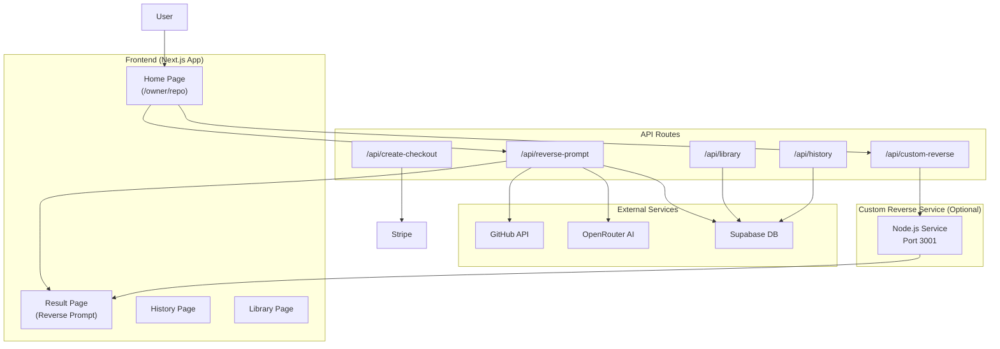

# GitReverse

<p align="center">
  
  
  
  
</p>

---

Turn a **public GitHub repository** into a **single synthetic user prompt** that someone might paste into Cursor, Claude Code, Codex, etc. to vibe code the project from scratch.

> 💡 **Goal**: Generate a short, conversational prompt grounded in the repo's context that helps AI coding assistants understand and recreate the project.

---

## 🎯 Features

- **Instant GitHub Analysis** - Enter any public repo URL or `owner/repo` to generate a reverse prompt
- **Smart Metadata Extraction** - Pulls repo metadata, root file tree (depth 1), and README automatically
- **LLM-Powered Generation** - Uses OpenRouter API to produce context-aware prompts
- **Shareable URLs** - Open `/owner/repo` (e.g., `/vercel/next.js`) for a direct shareable link
- **GitHub URL Compatibility** - `/owner/repo/tree/...` URLs redirect properly (no 404s)
- **Custom Reverse (Optional)** - Deep/focus prompts with custom context using a separate service
- **Server-Side Caching** - Supabase integration for caching successful runs
- **Rate Limiting** - Built-in protection against abuse
- **History & Library** - View past generated prompts and saved reverse prompts

---

## 🛠️ Tech Stack

| Category | Technology |
|----------|------------|
| **Framework** | Next.js 15 (App Router) |
| **Language** | TypeScript 5.3 |
| **Styling** | Tailwind CSS 3 |
| **AI Integration** | OpenRouter API |
| **GitHub API** | GitHub REST API |
| **Database** | Supabase (optional) |
| **Package Manager** | pnpm |
| **Deployment** | Vercel (recommended) |

---

## 📊 System Architecture



---

## ⚙️ Configuration

### Environment Variables

Create a `.env.local` file from `.env.example`:

```bash
cp .env.example .env.local
```

| Variable | Required | Description |
|----------|----------|-------------|
| `OPENROUTER_API_KEY` | ✅ Yes | API key from [OpenRouter](https://openrouter.ai/) |
| `OPENROUTER_MODEL` | No | Model to use (default: `google/gemini-2.5-pro`) |
| `GITHUB_TOKEN` | No | GitHub personal access token for higher rate limits |
| `SUPABASE_URL` | No | Your Supabase project URL |
| `SUPABASE_PUBLISHABLE_KEY` | No | Supabase publishable key |
| `CUSTOM_REVERSE_SERVICE_URL` | No | URL for custom reverse service (default: `http://localhost:3001`) |

### Custom Reverse Service (Optional)

For **deep/focus prompts**, run the separate TypeScript service:

1. Clone/set up the custom_reverse service project
2. Run `pnpm dev` (default port **3001**)
3. In `.env.local` set: `CUSTOM_REVERSE_SERVICE_URL=http://localhost:3001`
4. Enable **Custom reverse** on the home page

> ✅ Successful runs are stored in Supabase (`custom_prompt_cache`) when configured
> ❌ Cached entries are **not** shown in the public library

---

## 🚀 Getting Started

### Prerequisites

- Node.js 18+
- pnpm (recommended)
- GitHub Account
- OpenRouter API Key

### Installation

```bash
# Clone the repository
git clone https://github.com/girishlade111/gitreverse.git
cd gitreverse

# Install dependencies
pnpm install

# Setup environment variables
cp .env.example .env.local
# Edit .env.local with your API keys
```

### Development

```bash
# Start development server
pnpm dev

# Open in browser
# http://localhost:3000
```

### Production Build

```bash
# Build for production
pnpm build

# Start production server
pnpm start
```

### Code Quality

```bash
# Run linter
pnpm lint
```

---

## 📖 Usage

### Basic Reverse

1. Visit the homepage
2. Enter a GitHub URL (e.g., `https://github.com/vercel/next.js`) or `owner/repo` format
3. Click **Reverse** to generate the prompt
4. Copy and paste into your AI coding assistant

### Custom Reverse (Advanced)

1. Enable **Custom reverse** toggle on the home page
2. Describe what you want to reverse-engineer (specific features, components, etc.)
3. The custom service will generate a focused prompt

### URL Patterns

| URL | Description |
|-----|-------------|
| `/` | Home page |
| `/owner/repo` | Generate reverse for a repo |
| `/owner/repo/tree/main` | Redirects to `/owner/repo` |
| `/owner/repo/deep` | Deep analysis mode |
| `/owner/repo/focus` | Focus mode with specific context |
| `/history` | View your reverse history |
| `/library` | Browse saved prompts |

---

## 🔧 Stats & Metrics

- **Total Files** - 51 source files
- **Tech Stack** - 6 main technologies
- **API Routes** - 7 backend endpoints
- **Components** - 5 React components
- **Utilities** - 9 helper libraries

---

## 📝 License

MIT License - See [LICENSE](LICENSE) for details.

---

## 🙏 Acknowledgments

Shout out to [GitIngest](http://github.com/coderamp-labs/gitingest) for inspiration.

---

<p align="center">Made with ❤️ by Girish Lade</p>